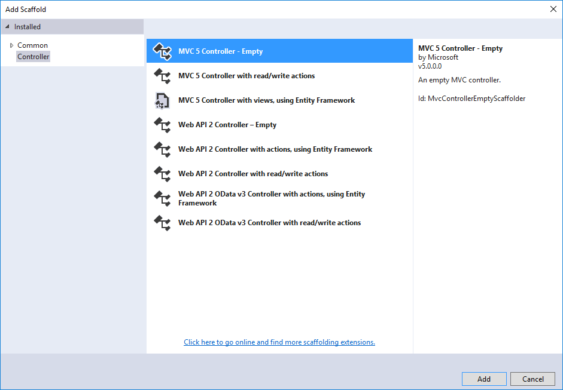
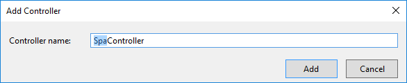
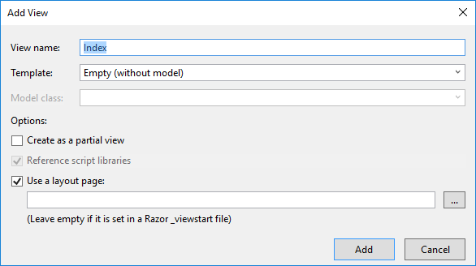
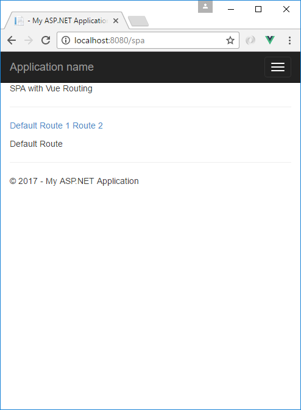

[Getting Started](../getting-started.md)  
# Add Client-Side Routing

To this all of the routes are handled by MVC.  In this section we will add client-side routing using Vue.js.

1.  Add a new empty MVC controller to the project and call it *Spa* as shown below:  


  

2. Add a new Razor View under /Views/Spa and call it *Index* as shown below:

  

3. Since we are using Vue.js to do client-side routing we'll need to add *Vue-Router* as a dependency in our npm configuration (package.json).  Let's add this now.
```
npm install vue-router --save
```  
4. Create a new folder called *spa* under /app/viewmodels and add the following javascript files:
* index.main.js
* index.vue
* index.routes.js

5. Add the following to index.vue.js
```
<template>
    <div>
        <p>{{title}}</p>      
        <hr />
        <p>
            <router-link to="/spa/">Default</router-link>
            <router-link to="/spa/route1">Route 1</router-link>
            <router-link to="/spa/route2">Route 2</router-link>
        </p>
        <!-- route outlet -->
        <router-view></router-view>
    </div>
</template>

<script>
    export default {
        data() {
            return {
                title: 'SPA with Vue Routing'
            }
        }
    }
</script>
```

6. Now let's add some routes. Add the following to index.routes.js:
```
const Default = { template: '<div>Default Route</div>' }
const Route1 = { template: '<div>Route 1</div>' }
const Route2 = { template: '<div>Route 2</div>' }

export const routes = [
    { path: '/spa/', component: Default},
    { path: '/spa/route1', component: Route1 },
    { path: '/spa/route2', component: Route1 }
];
```
Here we are creating 3 components and adding them to an array of routes.

7. Now add the following to our bootstrapper file (index.main.js):
```
import Vue from 'vue';
import VueRouter from 'vue-router';
import App from './index.vue';
import { routes } from './index.routes';

Vue.use(VueRouter);

const router = new VueRouter({
    routes: routes,
    mode: 'history',
    root: '/spa'
});

new Vue({
    el: '#app',
    router: router,
    render: h => h(App)
});
```

8. Replace the contents of /Views/Spa/Index.cshtml with the following:
```
<div id="app"></div>
@Scripts.Render("/dist/" + "spa.index.bundle.js")
```

9. Hit the easy button and navigate to */spa*. 



10. Our work is not done quite just yet. If you refresh the browswer while on the */Spa* page you will receive an error. Let's fix that in our MVC configuration (/App_Start/Route.config).

Add the following just above the default route definition:
```
    routes.MapRoute(
        name: "Silo Controller",
        url: "{controller}/{*.}",
        defaults: new { controller = "Home", action = "Index", id = UrlParameter.Optional },
        constraints: new { controller = "spa|spa2|spa3" }
    );
```
In the constraints above we've added our new *Spa* controller as well as a couple others that can be placeholders for future use. That's it we now have client-side routing with Vue.js.  

[Prev - Improving our Development Workflow Part 2](improving-our-development-workflow2.md)  
[Next - TBD](#)
