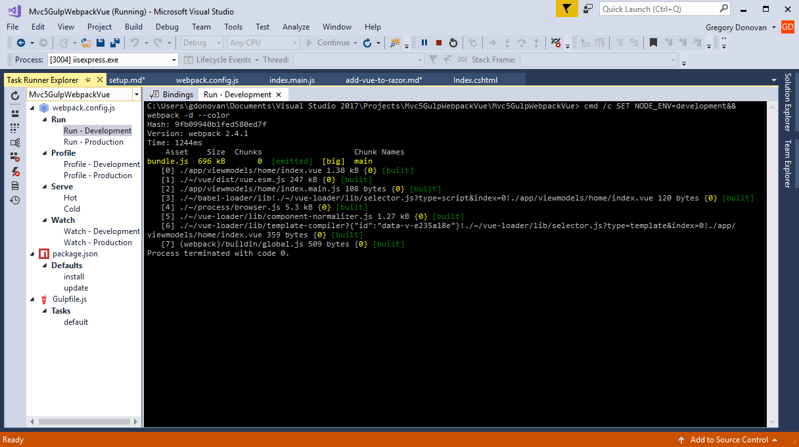
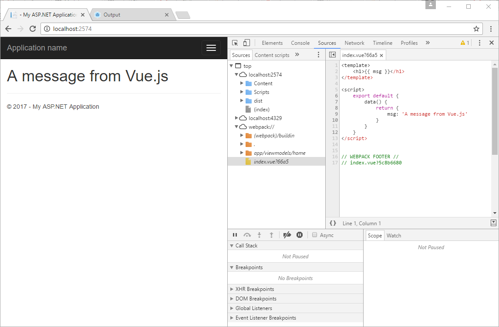

[Getting Started](../getting-started.md)  
# Add Vue.js to Razor Part I  


1. Add the following files (javascript) under 'app/viewmodels'home':  

* index.main.js - this is essentially the 'bootstrapper' file for our vue application  that will be rendered on our razor view. For bootstrapper files we will use the [viewname].main.js convention. The convention *main* is used because the entry point to applications is usually called main.js.  We are including the *view* as part of the name because as is the case with our default setup we may have multiple razor views for a single controller.
 
* index.vue - this is our vue file which will contain the html (template), the javascript required to interact with the template and any css that is exclusive to this file.

If you have the Vue.js Pack 2017 Visual Studio Extension installed your directory should look something like below:  

  

2. Add the following to index.vue  
```
<template>
    <h1>{{ msg }}</h1>
</template>

<script>
    export default {
        data() {
            return {
                msg: 'A message from Vue.js'
            }
        }
    }
</script>
```
3. Add the following to index.main.js

```
import Vue from 'vue'
import App from './index.vue'

new Vue({
    el: '#app',
    render: h => h(App)
})
```
Above we are importing vue, our index component, anchoring the component to the '#app' element and then rendering the component. In this script file we are using es6 syntax to pull in the modules we need.

4. Now that we have our bootstrapper and our vue files complete we need update our razor view.  In our bootstrapper file we told vue to inject our component in the '#app' element so we need to add a 'div' component with an id of 'app'.  Additionally, we also need to bring in our javascript code. Although the browser will understand index.main.js it needs a little help with the vue file (index.vue). For now simply replace the contents of /Views/Home/index.cshtml with the following:
 
```
<div id="app"></div>
@Scripts.Render("/dist/" + "bundle.js")
```  

5. Replace the contents of webpack.config with the following:
```
"use strict";
var path = require('path')
var webpack = require('webpack')

module.exports = {
    entry: "./app/viewmodels/home/index.main.js",
    output: {
        path: path.resolve(__dirname, './dist'),
        publicPath: '/dist/',
        filename: 'bundle.js'
    },
    module: {
        rules: [
            { test: /\.vue$/, loader: 'vue-loader', options: { loaders: {} } },
            { test: /\.js$/, loader: 'babel-loader', exclude: /node_modules/ },
            { test: /\.(png|jpg|gif|svg)$/, loader: 'file-loader', options: { name: '[name].[ext]?[hash]'} }
        ]
    },
    resolve: { extensions: ['.js', '.vue'], alias: { 'vue$': 'vue/dist/vue.esm.js' } },
    performance: { hints: false }    
};
```  
The main takeaway from the above is that we are telling webpack we have an entry point of '/app/viewmodels/home/index.main.js' and that our output (bundle) should be called 'bundle.js' - what we included in our razor view. We also added some packages at the top and defined some rules which essentially tell webpack how to handle vue files.  

6. Either thru Visual Studio or via the command line add the following packages with the --save-dev argument.  
 
* babel-core
* babel-loader
* babel-preset-latest
* vue-loader
* vue-template-compiler

package.json should resemble below:
```
{
  "version": "1.0.0",
  "name": "asp.net",
  "private": true,
  "devDependencies": {
    "babel-core": "^6.24.1",
    "babel-loader": "^6.4.1",
    "babel-preset-latest": "^6.24.1",
    "gulp": "^3.9.1",
    "vue-loader": "^11.3.4",
    "vue-template-compiler": "^2.2.6",
    "webpack": "^2.4.1"
  },
  "dependencies": {
    "vue": "^2.2.6"
  }
}
```

7. Now we need to bundle our javascript and this is where webpack comes in. We can kickoff webpack directly in Visual Studio using the Task Runner or via the command line. The following shows running webpack thru Visual Studio:  

   

You will notice that interally Visual Studio runs the following command:

```
cmd /c SET NODE_ENV=development&& webpack -d --color
```

8. Run baby Run! (F5). Open Chrome Developer Tools (F12) and expand the sources and you will see both the bundled code as well as the original code which you can debug.

   

[Prev - Setup Client Directory Structure](setup-client-directory-structure.md)  
[Next - Add Vue.js to Razor Part 2](add-vue-to-razor2.md)