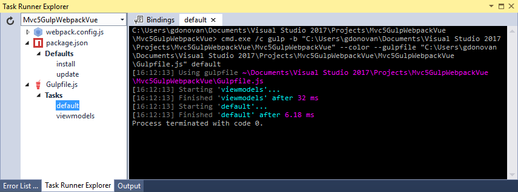
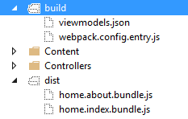

[Getting Started](../getting-started.md)  
# Improving our Development Workflow Part 1

To this point we've only added a couple of javascript applications but over time having to maintain our webpack configuration (webpack.config.js) could be problematic. Additionally, having to remember to run webpack each and every time is not ideal. Ideally these tasks will be run as part of our build.  This is where Gulp and Npm come in.  While having Npm, Gulp, and Webpack may seem overkill as they offer similar results, together they can solve the most complex of developer workflows. Gulp is commonly used to perform tasks in preparation of a build.  Webpack, recommended by Vue.js, is used for bundling and minification.  That leaves us with Npm which we will use to trigger our processes.  While they can run separately we will configure our build to run Npm scripts so all the developer needs to do is press [F5]. In this section we will focus on eliminating the need to manually maintain the entry points in our webpack configuration.

#### Adding Gulp to our Workflow  
We are going to use Gulp to eliminate the need to manually manage our webpack configuration (webpack.config.js). Replace the contents of gulpfile.js with the following:
```
/// <binding />
var gulp = require('gulp');
var file = require('gulp-file');
var fileList = require('gulp-filelist');
var _ = require('lodash');

var viewModelPath = 'App/ViewModels/';

gulp.task('viewmodels', function () {    
    var stream = gulp.src([viewModelPath + '**/*main.js'])
        .pipe(fileList('viewmodels.json', { relative: true}))
        .pipe(gulp.dest('build'));
        return stream;
});

gulp.task('default', ['viewmodels'], function () {    
    var entry = {};
    var fl = require('./build/viewmodels.json');
    _.each(fl, function (item, index) {
        var name = item.replace('main.js', '').replace('/', '.').toLowerCase();                
        entry[name] = './' +  viewModelPath + item;
    });            
    var output = 'module.exports = ' + JSON.stringify(entry);
    file('webpack.config.entry.js', output).pipe(gulp.dest('./build'));
});
```
While the above gulpfile defines two tasks - *default* and *viewmodels*, running gulp by itself will run both tasks as *viewmodels* is a dependency of *default*.  

Without getting overly geeky, together, the above tasks simply create an object literal that can then be imported into our webpack configuration. Before we can run these tasks we will need to install the following packages as dev dependencies:  
* gulp-file
* gulp-filelist  

Once installed run the *default* Gulp task. You can either use the Task Runner in Visual Studio as shown below 



or via the command line via 

```
gulp
``` 

Let's examine the output of the tasks:

#### viewmodels
```
[
  "home/about.main.js",
  "home/index.main.js"
]
```
In this task we are simply compiling a list of all of our *bootstrapper* files.

#### default
```
module.exports = {
    "home.about.main": "./app/viewModels/hom1e/about.main.js",
    "home.index.main": "./app/viewModels/home/index.main.js"
}
```
In this task we are transforming the results in the previous step into an object literal that we can import into our webpack configuration.  

Update webpack.config.js as follows:
1. Import /build/webpack.config.entry.js
```
var entry = require('./build/webpack.config.entry');
```
2. Replace the hardcoded entrypoints with the variable imported in #1
```
entry: entry,
```

Now run webpack and then the application. The output of running gulp and webpack can be seen below:  



[Prev - Add Vue.js to Razor Part 2](add-vue-to-razor2.md)  
[Next - Improving our Development Workflow Part 2](improving-our-development-workflow2.md)

