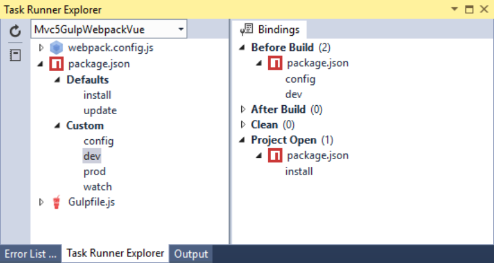

[Getting Started](../getting-started.md)  
# Improving our Development Workflow Part 2

In Part 1 we automated the entry points within our webpack configuration.  In this section will turn our dev workflow into an *easy* button.  To do this we'll simply add a couple of scripts to our npm configuration (package.json) and then configure our Task Runner bindings.

Add the following to package.json:
```
"scripts": {
    "config": "gulp",
    "dev": "cross-env NODE_ENV=development webpack --progress",
    "watch": "cross-env NODE_ENV=development webpack --watch --progress",
    "prod": "cross-env NODE_ENV=production webpack --progress --hide-modules"
  },
```
Here we have added the following scripts:
1. config  
   This script will simply run gulp which will update our webpack configuration
2. dev  
   This script runs webpack to bundle our javascript files
3. watch  
   This script is nearly identical to the *dev* script but it will automatically run every time a change has been made to any of our javascript files.
4. prod  
   This script will run our webpack build for production.  We will revisit this script a bit later.

Now we just need to update the bindings within Task Runner. Update the Task Runner bindings based on the picture below:

  

While we are free to run any of the tasks in either of the task runners (Npm, Gulp, Webpack), our *easy* button only requires us to configure Npm.  Here we are telling Npm to install our packages any time the project is opened and then we're setting the *config* and *dev* tasks to run prior to a Visual Studio build.

Before we can run either of these npm scripts we'll need to add *cross-env* to our list of dev dependencies in our npm configuration.  Either through the command line or through Visual Studio via the *Quick Install Package...* option run the following command:

```
npm install cross-env --save-dev
```

That's it - our *easy* button is complete.  

[Prev - Improving our Development Workflow Part 1](improving-our-development-workflow1.md)  
[Next - Add Client-Side Routing](add-client-side-routing.md)  


