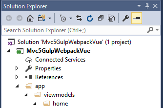

[Getting Started](../getting-started.md)  
# Setup Client-Side Directory Structure  

For separation of concerns I like to isolate our client-side code from our server-side code. Since our application will consist of multiple MVC views instead of having a single monolithic SPA we will essentially have a number of mini-spas if you will. To that end by convention I like to have the client-side code mirror the MVC *Views* folder. By default Visual Studio gave us a *Home* controller with a number of corresponding views - *About, Contact, and Index* to be exact. Assuming each of these views is to host a javascript application we might consider having the following directory structure: 

   

Go ahead and update your solution to match the picture above.

[Prev - Setup NPM](setup-npm.md)  
[Next - Add Vue.js to Razor Part 1](add-vue-to-razor1.md)

